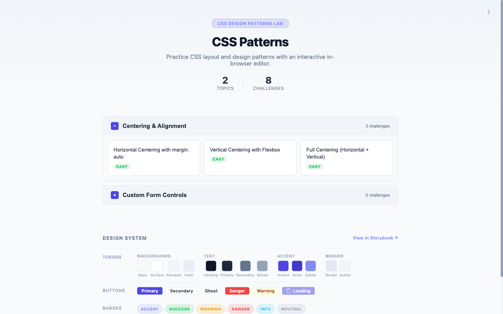
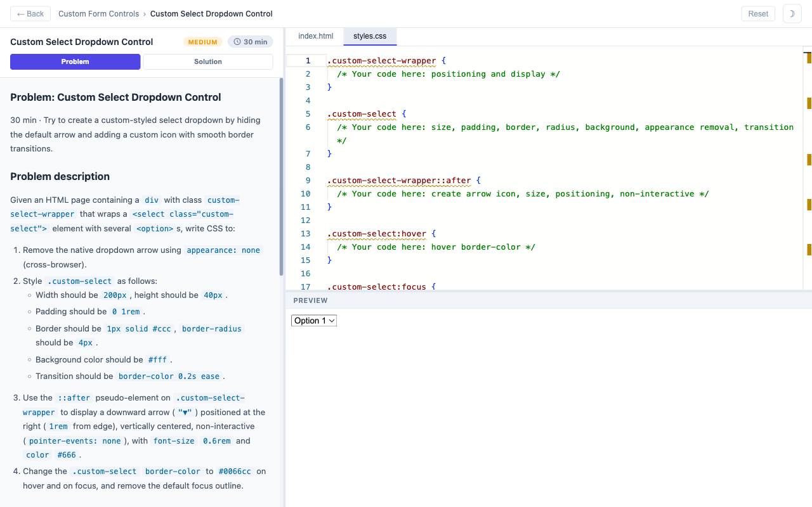
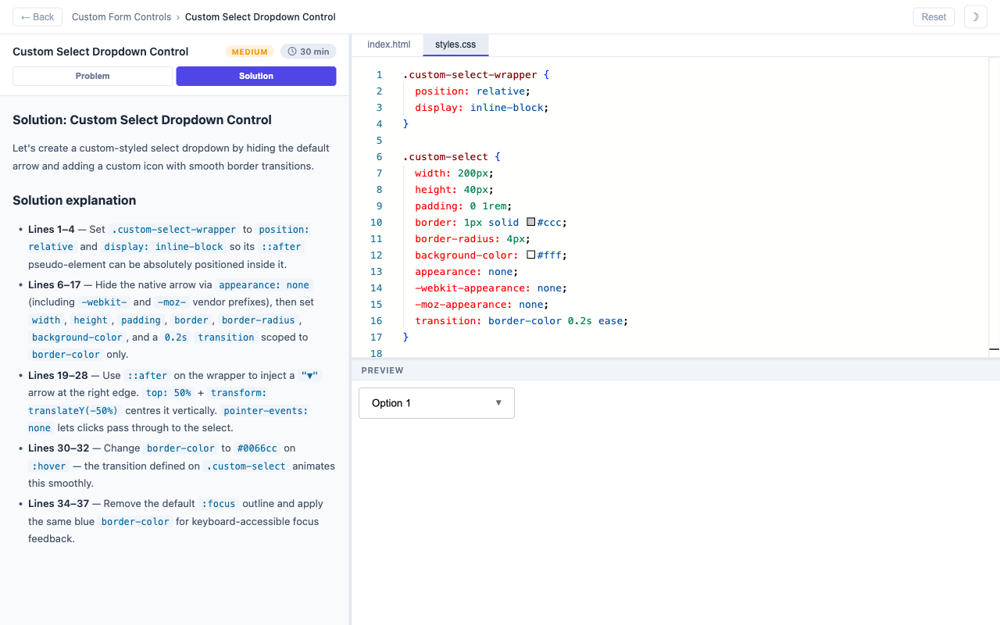

# CSS Design Patterns Lab

**Live demo:** [css-design-patterns.vercel.app](https://css-design-patterns.vercel.app)

An interactive CSS practice IDE for CSS Design Patterns. Work through challenges in a split-pane editor with a live preview, persistent progress, and solution reveal.







## Features

- **Curriculum browser** — expandable topic accordion with difficulty-tagged challenge cards
- **Split-pane IDE** — resizable instructions | editor | preview layout with persisted panel sizes
- **Monaco editor** — VS Code-quality editing with HTML and CSS file tabs, per-model undo history, loading skeleton
- **Structured instructions** — each challenge has Problem description, Goal, Constraints, and Sample visual output sections with difficulty badge and time estimate
- **Live iframe preview** — sandboxed `srcdoc` iframe rebuilt on every keystroke, fully isolated from the shell
- **Solution toggle** — swap starter ↔ solution code in the editor via Problem/Solution tabs
- **Sequential navigation** — Next button advances to the next challenge across topics
- **Progress persistence** — user edits saved to `localStorage` per challenge via Zustand
- **Starter-change detection** — notifies when upstream challenge files have been updated and offers a one-click reset to the new starter
- **Dark / light mode** — toggleable theme with smooth transition; preference persisted to `localStorage`

## Tech Stack

| Concern | Library |
|---|---|
| Shell | React 19 + TypeScript + Vite |
| Routing | React Router v7 (data router) |
| Code editor | `@monaco-editor/react` |
| Resizable panels | `react-resizable-panels` |
| State / persistence | Zustand with `persist` middleware |
| Instructions | `react-markdown` |
| Styles | CSS Modules + CSS custom properties (design tokens) |
| Theming | 25-token dark/light system via `data-theme` attribute |
| Design system docs | Storybook 10 (`@storybook/react-vite`) |
| Challenge content | `.html`, `.css`, `.md` files via Vite `?raw` imports |

## Getting Started

```bash
npm install
npm run dev        # app → http://localhost:5173
npm run storybook  # design system → http://localhost:6006
```

## Design System

The shell uses a token-based design system. All colors are defined as CSS custom properties in `src/styles/tokens.css` and consumed via `var(--token)` across every CSS Module. The Storybook instance is the living reference.

### Theme

Dark mode is the default. Switching to light mode sets `data-theme="light"` on `<html>`, which activates a full override block in `tokens.css`. The active theme is persisted to `localStorage` (`css-lab-theme`) via a Zustand store.

| Step | What happens |
|---|---|
| User clicks toggle | `useThemeStore().toggle()` flips `'dark'` → `'light'` |
| Zustand store updates | `App.tsx` `useEffect` fires |
| DOM write | `document.documentElement.dataset.theme = 'light'` |
| CSS cascade | All 25 `var(--token)` references resolve to their light values instantly |

### Token Groups

| Group | Tokens | Purpose |
|---|---|---|
| Background | `--bg-base` `--bg-surface` `--bg-elevated` `--bg-inset` `--bg-hover` `--bg-code` | Page layers from deepest to most raised |
| Border | `--border` `--border-subtle` | Default and low-contrast dividers |
| Text | `--text-heading` `--text-primary` `--text-body` `--text-secondary` `--text-tertiary` `--text-muted` | Semantic text roles |
| Accent | `--accent` `--accent-hover` `--accent-subtle` | Indigo — same in both themes |
| Warning | `--warning-bg` `--warning-border` `--warning-text` | Starter-change notification bar |
| Code | `--code-bg` `--code-text` | Inline code and code blocks |
| Editor | `--editor-bg` `--skeleton-base` `--skeleton-highlight` | Monaco canvas and loading skeleton |

### Storybook

```bash
npm run storybook
```

Four story groups under **Design System** in the sidebar:

| Story | What it shows |
|---|---|
| Color Tokens | All 25 token swatches with dark/light hex values — toggle theme to see live updates |
| Typography / Text Roles | The 6 semantic text-color tokens as specimen lines |
| Typography / Type Scale | All 10 font sizes (48px → 10px) with usage context |
| Theme / Overview | Mechanism explainer, token counts, and a full dark/light comparison table |
| Patterns / 1–7 | Each CSS + React pattern demonstrated live with annotated code |

## Component Library

`src/components/ui/` — reusable components built on the design token system. Each component demonstrates one or more scalable CSS + React patterns. Import from the barrel export:

```ts
import { Button, Badge, Toggle, RangeSlider, Card, Alert, CustomSelect } from './components/ui'
```

| Component | Key patterns |
|---|---|
| **Button** | `data-variant` + `data-size` · polymorphic `as` prop · component tokens · `:focus-visible` · logical properties (`padding-inline`) · loading spinner |
| **Badge** | `data-variant` · single-token `color-mix()` tint (bg + border + text from one `--badge-color`) |
| **Toggle** | `:checked` + adjacent sibling (`input:checked + .track`) · `::before` pseudo-element knob · `translateX()` animation · component tokens |
| **RangeSlider** | `::-webkit-slider-runnable-track` / `::-webkit-slider-thumb` · `-webkit-appearance: none` · calc-based centering formula · controlled + uncontrolled modes |
| **Card** | Compound components (`Card.Header` / `Card.Body` / `Card.Footer`) · `@container` queries · `overflow: hidden` corner clipping |
| **Alert** | Icon slot (render prop) · `color-mix()` tint · dismissible `useState` · `data-variant` |
| **CustomSelect** | `appearance: none` native arrow removal · `::after` custom arrow · `pointer-events: none` click-through · component tokens · `data-size` variants · `:has()` compound state |

Each component has a `.stories.tsx` file in the same folder. View them in Storybook under **Components**.

See [CONTRIBUTING.md](./CONTRIBUTING.md) for conventions on adding new components.

## Adding a Challenge

1. Create a folder under `src/challenges/<topic-id>/<challenge-id>/`
2. Add the required files:

```
<challenge-id>/
├── meta.ts           # wires all imports, exports a Challenge object
├── instructions.md   # problem instructions (Problem description, Goal, Constraints)
├── solution.md       # solution explanation shown in the Solution tab
├── starter.html
├── starter.css
├── solution.html
└── solution.css
```

3. Export the challenge from the topic's `index.ts` and add the topic to `src/curriculum/index.ts`

### `meta.ts` template

```ts
import type { Challenge } from '../../../types/challenge'
import instructions from './instructions.md?raw'
import solutionExplanation from './solution.md?raw'
import starterHtml from './starter.html?raw'
import starterCss from './starter.css?raw'
import solutionHtml from './solution.html?raw'
import solutionCss from './solution.css?raw'

export const challenge: Challenge = {
  id: 'your-challenge-id',
  title: 'Your Challenge Title',
  difficulty: 'easy', // 'easy' | 'medium' | 'hard'
  estimatedMinutes: 15,
  instructions,
  solutionExplanation,
  starterHtml,
  starterCss,
  solutionHtml,
  solutionCss,
}
```

## Project Structure

```
.storybook/
├── main.ts                          # Storybook framework + addons config
└── preview.ts                       # Global decorator (theme toggle), CSS import

src/
├── App.tsx                          # Router setup + theme store → data-theme sync
├── main.tsx
├── types/challenge.ts               # Challenge, Topic interfaces
├── curriculum/index.ts              # Map-keyed registry, findChallenge(), findNextChallenge()
├── store/
│   ├── editorStore.ts               # Zustand: per-challenge editor state
│   └── themeStore.ts                # Zustand: 'dark' | 'light', persisted
├── challenges/
│   └── <topic-id>/
│       ├── index.ts                 # Topic metadata
│       └── <challenge-id>/
│           ├── meta.ts
│           ├── instructions.md
│           ├── starter.html / .css
│           └── solution.html / .css
├── components/
│   ├── NotFoundPage.tsx
│   ├── ThemeToggle.tsx              # ☀︎ / ☽ button wired to themeStore
│   ├── curriculum/
│   │   ├── CurriculumPage.tsx
│   │   └── TopicSection.tsx
│   ├── editor/
│   │   ├── ChallengePage.tsx        # IDE route with data loader
│   │   ├── InstructionsPanel.tsx
│   │   ├── EditorArea.tsx           # Monaco theme driven by themeStore
│   │   └── PreviewFrame.tsx
│   └── ui/                          # Reusable component library
│       ├── index.ts                 # Barrel export
│       ├── Button/                  # Polymorphic as prop + data-variant + component tokens
│       ├── Badge/                   # data-variant + color-mix() tint
│       ├── Toggle/                  # :checked + sibling + ::before animation
│       ├── RangeSlider/             # ::-webkit-slider-* pseudo-elements
│       ├── Card/                    # Compound components + @container
│       ├── Alert/                   # Icon slot + color-mix() + dismissible
│       └── CustomSelect/            # appearance: none + ::after arrow + component tokens
├── stories/
│   └── design-system/
│       ├── ColorTokens.stories.tsx
│       ├── Typography.stories.tsx
│       ├── Theme.stories.tsx
│       └── Patterns.stories.tsx     # 7 pattern demos with live code
└── styles/
    ├── tokens.css                   # 25 CSS custom properties, dark + light values
    └── app.css                      # Global resets, imports tokens.css
```
